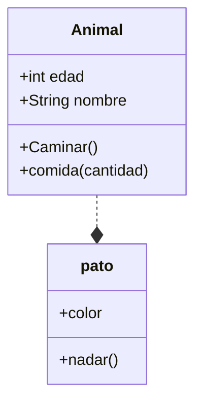

# Diagrama-clases c++ y java

```mermaid
 classDiagram
   class Animal
   Animal: +int edad
   Animal: +String nombre
   Animal: +Caminar() 
   Animal: +comida(cantidad) 

     class pato{
            +color
            +nadar()
        
     }
     Animal..* pato 

```
